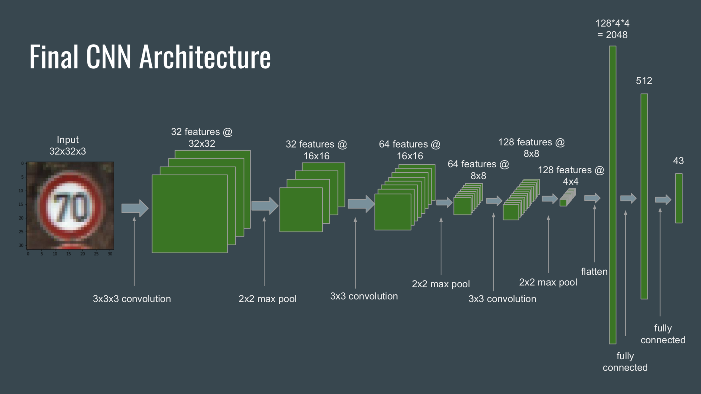
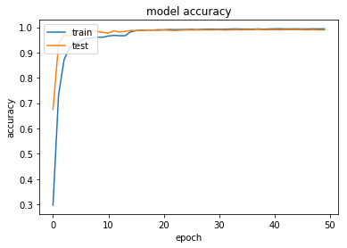
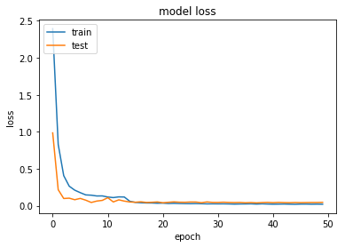

# Traffic-Sign-Classification
Classification of 43 different classes of German traffic sign images (GTSRB) by training a Keras CNN from scratch. Part of a project from the NTNU Computer Vision course.

The dataset can be downloaded [here](http://benchmark.ini.rub.de/?section=gtsrb&subsection=dataset). The train and test images are the Images and annotations. Make sure that the training images are located under *GTSRB/Final_Training/*, while the testing images are located under *GTSRB/Final_Test/*.

**Required packets**: keras, tensorflow, scikit-image, h5py, pandas, matplotlib

## CNN architecture

To classify the images, a CNN with three convolutional layers followed by two fully connected layers was used. Each convolutional layer was followed by a 2x2 max pooling operation and we used dropout after each layer.

All hiden layers use the PReLU activation function, while the last layer uses a softmax function for the classification. The categorical cross entropy loss was minimised using a SGD optimiser. 

## Training

All images are scaled to 32x32 (x3 colour channels) pixels. Because we only have 39'209 images, we augment the dataset by rotating, shearing, translating and zooming existing images. As another preprocessing step, we apply contrast stretching, which yielded slightly better results than applying histogram equalisation.

Initially, after 35 epochs of training, the model accuracy dropped suddenly to zero. This problem was resolved by adapting the learning rate over time using “ReduceLROnPlateau”.

 

The model achieves an accuracy of 0.9896 on the test data. This model is saved as *final_model.h5*.
